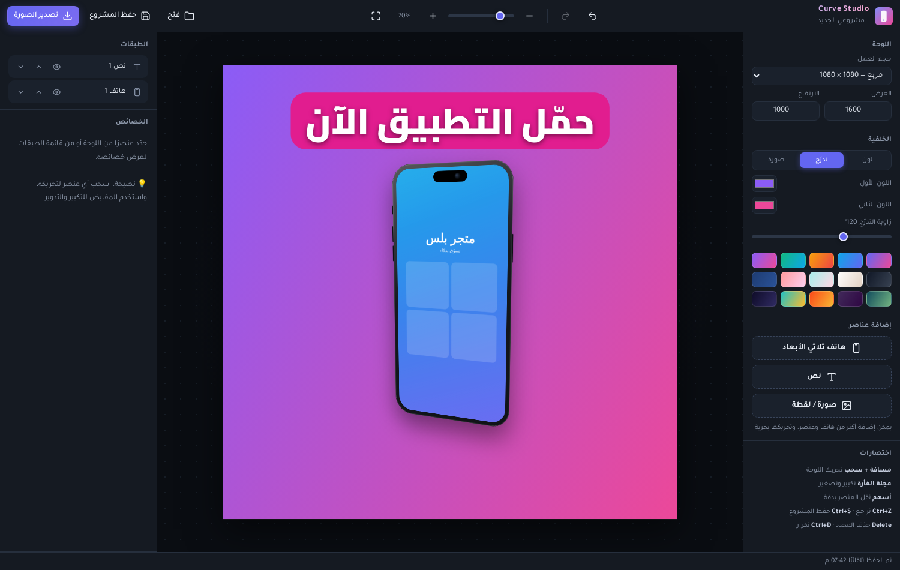
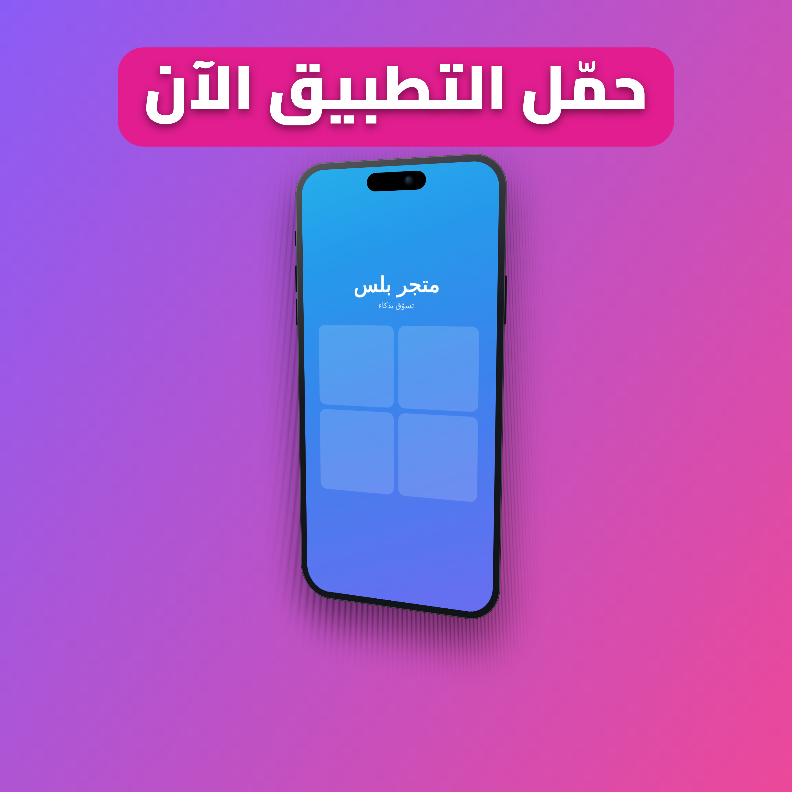

# 🎨 Curve Studio — استوديو الموكاب الاحترافي

أداة ويب عربية بالكامل لصناعة **موكاب (Mockup)** احترافي لتطبيقاتك ولقطات شاشتك — بدون تسجيل، بدون خادم، تعمل مباشرة من المتصفح.

## ✨ المميزات

- **لوحة عمل مرنة**: ابدأ بصفحة بيضاء وغيّر حجم العمل كما تشاء (مربع، مستطيل، ستوري…) مع مقاسات جاهزة وخلفيات (لون / تدرج / صورة) وتدرجات جاهزة.
- **هواتف ثلاثية الأبعاد**: إطارات آيفون وأندرويد وبسيط بجودة عالية، مع أوضاع إمالة ثلاثية الأبعاد جاهزة ومنزلقات إمالة يدوية (↕ ↔)، ظل واقعي، لون إطار مخصص، وأزرار جانبية تفصيلية.
- **لقطاتك كما تحب**: ارفع لقطة الشاشة داخل الهاتف (تغطية / احتواء / تمديد)، أو أضفها كصورة حرة بزوايا مستديرة وظل.
- **عدد غير محدود من العناصر**: أضف أكثر من هاتف، نص، وصورة في نفس التصميم.
- **نصوص عربية وإنجليزية**: 20 خطًا مختارًا (Cairo، Tajawal، Noto Kufi، Amiri، Poppins، Bebas…) مع سماكات، ألوان، تباعد أسطر وأحرف، ظل، وخلفية "حبّة" خلف النص.
- **تحرير حر**: تحريك بالسحب، تكبير/تصغير من المقابض، تدوير، محاذاة سريعة للوحة (3×3)، خطوط محاذاة ذكية، ترتيب الطبقات (فوق/تحت)، إخفاء، تكرار، تراجع/إعادة غير محدودة.
- **تصدير عالي الجودة**: PNG حتى ×3 و JPG — المعاينة مطابقة تمامًا للنتيجة النهائية لأن كليهما يرسمان بنفس المحرك.
- **حفظ المشاريع**: حفظ تلقائي في المتصفح + تصدير/فتح ملف مشروع `.curve.json` كامل بالصور.

## 🚀 الاستخدام

افتح `index.html` مباشرة في المتصفح — لا حاجة لأي تثبيت أو بناء.

أو زر النسخة المنشورة على GitHub Pages.

## ⌨️ اختصارات

| الاختصار | الوظيفة |
|---|---|
| مسافة + سحب | تحريك اللوحة |
| عجلة الفأرة | تكبير / تصغير |
| أسهم (+Shift) | نقل العنصر بدقة |
| Ctrl+Z / Ctrl+Shift+Z | تراجع / إعادة |
| Ctrl+D | تكرار العنصر |
| Delete | حذف العنصر |
| Ctrl+S | حفظ المشروع كملف |
| نقرة مزدوجة على نص | تحرير النص مباشرة |
| نقرة مزدوجة على هاتف | استبدال اللقطة |

## 🛠️ التقنية

Vanilla HTML/CSS/JS فقط — بدون أي مكتبات خارجية أو خطوة بناء.

- العناصر تُدار كـ DOM للتحرير التفاعلي (سحب، مقابض، منظور CSS ثلاثي الأبعاد).
- التصدير يستخدم محرك Canvas خاصًا يرسم الهاتف (إطار معدني، Dynamic Island، وهج زجاجي، ظل) ثم يسقطه بمنظور حقيقي عبر **Homography** (تحويل إسقاطي بالشرائح) لمطابقة معاينة CSS بكسلًا ببكسل.
- الخطوط من Google Fonts، والتشكيل العربي في Canvas أصلي من المتصفح.

---

## English

**Curve Studio** — a free, open-source, Arabic-first mockup studio that runs entirely in the browser. Add unlimited 3D-tilted phone frames with your screenshots, Arabic/English text layers with 20 curated fonts, free image layers, flexible canvas sizes and backgrounds (color/gradient/image) — then export pixel-perfect PNG (up to 3×) or JPG. No build step: open `index.html` or the GitHub Pages deployment.

